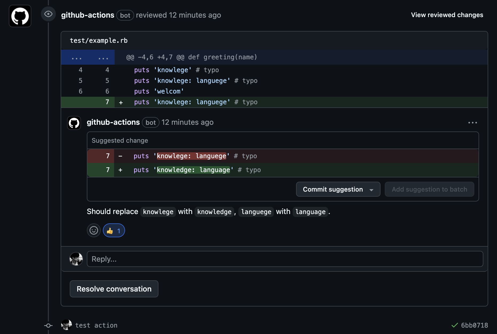
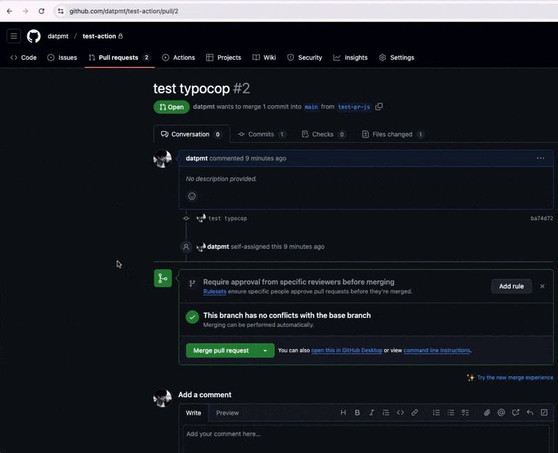

# Check Typos in Pull Request
[](https://badge.fury.io/rb/typocop)



This GitHub Action automatically checks for typos in the files changed in a pull request. It comments on the pull request with any detected typos and provides suggestions for corrections.

## Features

- Automatically detects typos in files changed in a pull request.
- Comments on the pull request with a list of typos found and suggested corrections.
- Approves the pull request if no typos are detected.
- Dismisses PR approvals if a new commit contains a typo.
- Removes outdated typo comments when new commits are made.
- Supports all programming languages.

## Usage

1. **Using Typocop GitHub Action:**

    1. Copy the `.github/workflows/typocop.yml` file into your project repository.

        ```yaml
        # .github/workflows/typocop.yml
        name: Check Typos in Pull Request

        on: [pull_request]

        jobs:
          typocop:
            permissions: write-all
            runs-on: ubuntu-latest
            steps:
              - name: Checkout repository
                uses: actions/checkout@v3
                with:
                  fetch-depth: 0

              - name: Run Typocop Action
                uses: datpmt/typocop@main
                with:
                  github_token: ${{ secrets.GITHUB_TOKEN }}
                  pull_request_id: ${{ github.event.pull_request.number }}
                  github_base_ref: ${{ github.base_ref }}
                  setting: .github/typocop/setting.yml # Optional: Path to your custom settings file
        ```

    2. Customize settings (optional):

        By default, Typocop uses predefined settings, but you can create a custom settings file in your repository. For example, create .github/typocop/setting.yml to specify exclusion rules and skip lists.

        Example `.github/typocop/setting.yml`:

          ```yaml
          excludes:  # Files and directories to exclude
            - excludes/exclude.rb
            - excludes/test/*

          skips:  # Words or patterns to skip during typo detection
            - rspec
            - eligible
          ```

        - **excludes**: Specifies files or directories to exclude from typo checking.
        - **skips**: Specifies words or patterns to skip checking (useful for technical terms or domain-specific language).

    3. Create a new Pull Request (PR) to trigger the action.
2. **Using Typocop command line**

    ```bash
    gem install typocop # install

    GITHUB_TOKEN=your_token PULL_REQUEST_ID=your_pull_request_id typocop execute # run action
    ```

    

## Contributing

We welcome contributions to this project! To contribute:

1. Fork the repository.
2. Create a new feature branch (git checkout -b your-feature).
3. Commit your changes (git commit -am 'Add some feature').
4. Push the changes to your fork (git push origin your-feature).
5. Open a pull request.

## Contributors

- Tran Dang Duc Dat ([datpmt](https://github.com/datpmt))
- Hoang Duc Quan ([BlazingRockStorm](https://github.com/BlazingRockStorm))

## References
- [Typo Checker](https://github.com/datpmt/typo_checker)
- [Pronto Labs](https://github.com/prontolabs/pronto)

## License
The gem is available as open source under the terms of the [MIT License](LICENSE).
